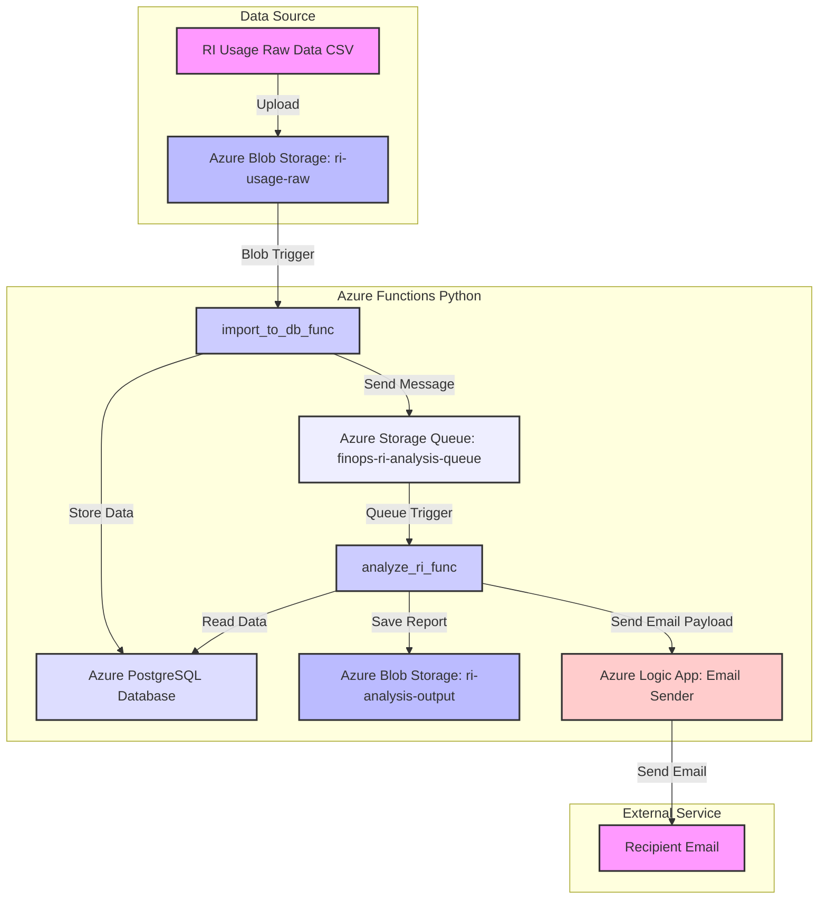

# FinOps RI Reporting Automation (Azure Functions & PostgreSQL)

## Overview

This project aims to automate the process of Azure Reserved Instance (RI) utilization analysis and reporting. By combining Azure Functions, Azure Storage, PostgreSQL database, and Azure Logic Apps, it achieves a fully automated workflow from raw data import, data analysis, report generation, to final email notification.

**Core Workflow:**

1. **Data Ingestion**: Raw RI utilization data in CSV format is uploaded to Azure Blob Storage.
2. **Data Processing & Ingestion** (`import_to_db_func`): A Blob upload event triggers an Azure Function to parse the CSV data and import it into an Azure PostgreSQL database.
3. **Analysis Trigger**: Upon successful data ingestion, `import_to_db_func` sends a message to an Azure Storage Queue.
4. **Data Analysis & Report Generation** (`analyze_ri_func`): The queue message triggers another Azure Function, which reads data from the PostgreSQL database, performs RI utilization analysis, and generates an Excel report.
5. **Report Storage**: The generated Excel report is saved to a designated container in Azure Blob Storage.
6. **Email Notification**: The Function App sends an email with the report attachment by invoking an Azure Logic App.

## Architecture Diagram



## Azure Service Architecture & Design Rationale

This solution leverages several key Azure services, chosen for their serverless nature, scalability, cost-efficiency, and seamless integration capabilities.

- **Azure Blob Storage**:
  - **Rationale**: Used for raw data ingestion (`ri-usage-raw` container) and storing generated reports (`ri-analysis-output` container). Blob storage is highly scalable, durable, and cost-effective for unstructured data. Its event-driven capabilities (Blob Triggers) are essential for initiating the data processing workflow.
- **Azure Functions**:
  - **Rationale**: Chosen for its serverless compute model. Functions allow for event-driven execution (Blob and Queue triggers) without managing underlying infrastructure. They are cost-efficient (pay-per-execution) and scale automatically to handle varying workloads. Python was selected for its strong data processing libraries.
  - **`import_to_db_func`**: Handles the initial data transformation and persistence. Its Blob trigger ensures processing begins immediately upon data upload.
  - **`analyze_ri_func`**: Performs the core business logic of RI analysis and report generation. The Queue trigger decouples it from `import_to_db_func`, allowing for more robust and retriable processing if the analysis step fails.
- **Azure PostgreSQL Flexible Server**:
  - **Rationale**: A fully managed relational database service. PostgreSQL was chosen for its robust SQL capabilities, open-source nature, and suitability for structured analytical data. The Flexible Server option provides fine-grained control, better cost optimization, and high availability features if needed, while still reducing operational overhead compared to self-managed databases.
- **Azure Storage Queue**:
  - **Rationale**: Acts as a messaging intermediary between `import_to_db_func` and `analyze_ri_func`. Queues provide loose coupling, asynchronous processing, and built-in retry mechanisms, making the workflow more resilient to transient failures.
- **Azure Key Vault**:
  - **Rationale**: Securely stores sensitive information like database connection strings and Logic App endpoints. Key Vault ensures that secrets are not hardcoded in application code or configuration files, enhancing security and compliance. Managed Identities for Azure resources allow Function Apps to securely access Key Vault without needing explicit credentials.
- **Azure Logic Apps**:
  - **Rationale**: A low-code/no-code workflow automation service. It's ideal for integrating with external services like email providers without writing custom code. The HTTP Request trigger makes it easy to integrate with Azure Functions.
  - **`Email Sender` Logic App**: Specifically designed to handle email notifications. It abstracts away the complexities of SMTP or API interactions with email services, providing a simple HTTP endpoint for the Function App to call.

This design emphasizes **serverless patterns, loose coupling, event-driven architecture, and managed services** to achieve a highly scalable, resilient, and cost-effective FinOps reporting solution.

## Local Run Guide

Running Azure Functions locally is primarily for development and debugging. You'll need to simulate Azure services or use development connections.

### Prerequisites

- Python 3.8+
- Azure Functions Core Tools v4.x
- Docker (if using local PostgreSQL container)
- PostgreSQL client tools (e.g., `psql`)
- `venv` or `conda` for virtual environment management

### 1. Clone Project & Set Up Environment

```bash
git clone <your-repo-url>
cd finops-ri-reporting-automation # Assuming your project root directory
python -m venv .venv
source .venv/bin/activate # macOS/Linux
# .venv\Scripts\activate # Windows

pip install -r requirements.txt
```

### 2. Local PostgreSQL Database Setup

You can use Docker to run a local PostgreSQL instance:

```bash
docker run --name local-postgres -e POSTGRES_PASSWORD=your_db_password -p 5432:5432 -d postgres:13
```

Connect to the database and create the database and table:

```
# Connect to PostgreSQL, default user is 'postgres'
psql -h localhost -p 5432 -U postgres

# In the psql command line
CREATE DATABASE ri_finops_db;
\c ri_finops_db;

CREATE TABLE ri_finops_data (
    id SERIAL PRIMARY KEY,
    region VARCHAR(255),
    sku VARCHAR(255),
    start_date DATE,
    end_date DATE,
    utilization_percentage NUMERIC(5, 2),
    cost_saved NUMERIC(10, 2),
    recommendation TEXT,
    ingestion_timestamp TIMESTAMP WITH TIME ZONE DEFAULT CURRENT_TIMESTAMP
);

\q # Exit psql
```

### 3. Configure Local Settings

Create a `local.settings.json` file in the `azure_functions` directory:

```JSON
{
  "IsEncrypted": false,
  "Values": {
    "AzureWebJobsStorage": "UseDevelopmentStorage=true", // Or your Azure Storage connection string
    "FUNCTIONS_WORKER_RUNTIME": "python",
    "DATABASE_CONNECTION_STRING": "Host=localhost;Database=ri_finops_db;Username=postgres;Password=your_db_password;SslMode=Disable;", // Modify with your local PostgreSQL connection info
    "LOGICAPP_ENDPOINT": "https://your-logic-app-http-trigger-url-for-testing", // If you want to test email sending, provide Logic App's HTTP trigger URL
    "RECIPIENT_EMAIL": "your_email@example.com",
    "MIN_UTILIZATION_THRESHOLD": "60.0",
    "EXPIRY_WARNING_DAYS": "30"
  },
  "Host": {
    "CORS": "*" // Allows CORS for local debugging
  }
}
```

- `AzureWebJobsStorage`: `UseDevelopmentStorage=true` will use Azurite (local Azure Storage emulator) or the actual Azure Storage Emulator. Ensure you have Azurite installed and running.
- `DATABASE_CONNECTION_STRING`: Make sure it points to your locally running PostgreSQL instance.
- `LOGICAPP_ENDPOINT`: If you want to simulate email sending locally, you can temporarily point this to a real Logic App HTTP trigger URL, otherwise `analyze_ri_func` will attempt to call it.

### 4. Run Azurite (Local Storage Emulator)

If you're using `UseDevelopmentStorage=true`, ensure Azurite is running:

```bash
azurite --location . --debug .azurite_debug.log
```

### 5. Run Functions Locally

Open two terminal windows in the `azure_functions` directory.

**Terminal 1 (Run `import_to_db_func`):**

```bash
func host start --functions import_to_db_func
```

**Terminal 2 (Run `analyze_ri_func`):**

```bash
func host start --functions analyze_ri_func
```

### 6. Test Local Workflow

1. Create a mock CSV file, for example, `mock_ri_data.csv`:

   Code snippet

   ```
   Region,SKU,StartDate,EndDate,UtilizationPercentage,CostSaved,Recommendation
   East US,Standard_D2as_v4,2024-01-01,2025-01-01,85.50,1200.00,None
   West US,Standard_B2ms,2024-02-15,2025-02-15,45.20,500.00,Consider resizing
   Central US,Standard_F4s_v2,2024-03-01,2024-07-01,95.00,2000.00,Good utilization
   Canada Central,Standard_DS1_v2,2024-04-10,2025-04-10,30.10,300.00,Expiring soon, underutilized
   ```

2. **Manually Simulate Blob Upload (to trigger `import_to_db_func`)**: Since local Function Apps cannot directly listen to Azurite Blob events, you need to manually place the file into Azurite's simulated Blob container, or use Azure Storage Explorer to connect to Azurite and upload.

   Alternatively, you could manually call the `import_to_db_func` HTTP trigger (if you temporarily changed it to an HTTP trigger for local testing, though this is generally not recommended for changing function types).

   **The simplest method is using Azure Storage Explorer:**

   - Connect to Local Storage (Azurite).
   - Create a container named `ri-usage-raw` under Blob Containers.
   - Upload `mock_ri_data.csv` to the `ri-usage-raw` container.

   This will trigger `import_to_db_func`, which imports data into PostgreSQL, and sends a queue message. `analyze_ri_func` will then receive the queue message and continue processing.


## Azure Deployment Guide

This section covers deploying Azure infrastructure using Terraform and deploying Function App code using Azure Functions Core Tools.

### Prerequisites

- Azure Subscription
- Azure CLI (logged in and correct subscription selected)
- Terraform CLI (v1.0+)
- Azure Functions Core Tools v4.x

### 1. Terraform Configuration (`main.tf`)

Ensure your `main.tf` file includes the following core resources, and has been updated as per the provided code:

- `azurerm_resource_group`
- `azurerm_storage_account` (including Blob Containers and the **queue** `finops-ri-analysis-queue`)
- `azurerm_application_insights`
- `azurerm_service_plan` (Consumption Plan)
- `azurerm_linux_function_app` (including `RECIPIENT_EMAIL` and other `app_settings`, as well as Managed Identity permissions)
- `azurerm_postgresql_flexible_server`
- `azurerm_key_vault`
- `azurerm_key_vault_secret` (for DB connection string, Logic App Endpoint, etc.)
- `azurerm_role_assignment` (to assign Key Vault, Storage Blob, and **Storage Queue** permissions to the Function App's Managed Identity)
- `azurerm_resource_group_template_deployment` (for deploying the Logic App)

**Ensure the following queue definition is added after your `azurerm_storage_account.main` resource:**

```Terraform
# Storage Queue for Function App Inter-communication (import_to_db_func -> analyze_ri_func)
resource "azurerm_storage_queue" "finops_ri_analysis_queue" {
  name                 = "finops-ri-analysis-queue"
  storage_account_name = azurerm_storage_account.main.name # References the 'main' storage account defined above
}
```

**Ensure `RECIPIENT_EMAIL` is added to the `app_settings` of `azurerm_linux_function_app.main`:**

```Terraform
  app_settings = {
    # ... other settings ...
    "RECIPIENT_EMAIL" = var.recipient_email 
  }
```

**Ensure the Function App's permission for the queue is added:**

```Terraform
resource "azurerm_role_assignment" "func_app_storage_queue_data_contributor" {
  scope                = azurerm_storage_account.main.id
  role_definition_name = "Storage Queue Data Contributor" 
  principal_id         = azurerm_linux_function_app.main.identity[0].principal_id
}
```

### 2. Variable Configuration

Ensure your `variables.tf` file defines all variables, for example:

```Terraform
variable "resource_group_name" { type = string }
variable "environment" { type = string }
variable "location" { type = string }
variable "unique_suffix" {
  type        = string
  default     = "" # If empty, random suffix will be generated
  description = "A unique suffix to append to resource names."
}
variable "blob_container_names" {
  type        = list(string)
  default     = ["ri-analysis-output", "ri-email-reports", "ri-usage-raw", "scm-releases"]
  description = "List of blob container names to create."
}
variable "app_service_plan_sku" { type = string }
variable "python_version" { type = string }
variable "postgresql_sku_name" { type = string }
variable "postgresql_storage_mb" { type = number }
variable "postgresql_admin_username" { type = string }
variable "postgresql_admin_password" {
  type        = string
  sensitive   = true
}
variable "allowed_ip_addresses" {
  type        = list(string)
  default     = []
}
variable "email_method" {
  type        = string
  description = "Method for sending emails: 'smtp' or 'logicapp'."
  default     = "logicapp"
  validation {
    condition = contains(["smtp", "logicapp"], var.email_method)
    error_message = "Email method must be 'smtp' or 'logicapp'."
  }
}
variable "smtp_host" {
  type        = string
  default     = ""
  description = "SMTP host if email_method is 'smtp'."
  sensitive   = true
}
variable "smtp_port" {
  type        = number
  default     = 587
}
variable "smtp_user" {
  type        = string
  default     = ""
  description = "SMTP username if email_method is 'smtp'."
  sensitive   = true
}
variable "smtp_pass" {
  type        = string
  default     = ""
  description = "SMTP password if email_method is 'smtp'."
  sensitive   = true
}
variable "smtp_sender" {
  type        = string
  default     = ""
  description = "SMTP sender email address if email_method is 'smtp'."
}
variable "min_utilization_threshold" {
  type        = number
  default     = 60
  description = "Minimum RI utilization percentage for reporting."
}
variable "expiry_warning_days" {
  type        = number
  default     = 30
  description = "Number of days before RI expiry to issue a warning."
}
variable "analysis_window_days" {
  type        = number
  default     = 90
  description = "Number of past days for RI utilization analysis."
}
variable "underutilized_days_threshold" {
  type        = number
  default     = 30
  description = "Days of underutilization to flag as significant."
}
variable "unused_days_threshold" {
  type        = number
  default     = 7
  description = "Days of complete unused RI to flag."
}
variable "default_region" {
  type        = string
  default     = "East US"
}
variable "default_sku" {
  type        = string
  default     = "Standard_D2as_v4"
}
variable "recipient_email" { # <--- NEW VARIABLE
  description = "Email address to send RI analysis reports to."
  type        = string
}
```

And provide actual values in `terraform.tfvars`:

```Terraform
resource_group_name = "rg-finops-ri-reporting-dev"
environment         = "dev"
location            = "Canada Central"
unique_suffix       = "finopstest" # For consistent naming, or leave empty for random
app_service_plan_sku = "Y1" # Consumption plan
python_version      = "3.9" # Match your function app's python version
postgresql_sku_name = "Standard_D2ds_v4"
postgresql_storage_mb = 32768
postgresql_admin_username = "finopsadmin"
postgresql_admin_password = "YourStrongDbPassword123!"
allowed_ip_addresses = ["your.public.ip.address/32"] # Add your local IP to access DB

email_method        = "logicapp" # Using Logic App for email
# smtp_host = "smtp.example.com" # Only if email_method is "smtp"
# smtp_user = "user@example.com" # Only if email_method is "smtp"
# smtp_pass = "SmtpPassword"     # Only if email_method is "smtp"
# smtp_sender = "noreply@example.com" # Only if email_method is "smtp"

recipient_email = "your_email@yourdomain.com" # <--- YOUR RECIPIENT EMAIL
```

### 3. Logic App ARM Template

Ensure you have a `logicapp_template.json` file that defines the Logic App with an HTTP trigger and an Office 365 Outlook "Send an email (V2)" operation.

### 4. Deploy Azure Infrastructure (Terraform)

Run the following commands in your Terraform project root directory:

```bash
terraform init
terraform plan
terraform apply
```

During `terraform apply`, carefully review the output and type `yes` to confirm. This will create all your Azure resources, including the Storage Account, Blob Containers, Queue, PostgreSQL database, Function App, and Key Vault.

**Note:** If you encounter the Key Vault or PostgreSQL immutable property errors discussed previously, please handle them according to the earlier advice:

- **For Key Vault permission errors**: Grant the identity running `terraform apply` the `Key Vault Contributor` role.
- **For other immutable property errors**: If it's a development/test environment, the simplest approach is `terraform destroy` (ensuring data backup!) followed by `terraform apply`.

### 5. Manual Adjustments for Email Sending (Logic App)

While Terraform can deploy the Logic App resource, **manual intervention is required for the "Send an email (V2)" action within the Logic App's workflow after deployment.** This is because:

- **OAuth Authentication**: The "Send an email (V2)" action (especially for Office 365 Outlook) requires an OAuth connection to an M365 user account. This connection typically involves an interactive sign-in process that cannot be fully automated via ARM templates or Terraform alone, as it requires user consent.
- **Service Principal Limitations**: While Logic Apps can use Managed Identities, directly authenticating to Office 365 APIs for sending emails usually requires a user context for simple "Send email" actions, or a more complex App Registration with delegated permissions for service principal scenarios, which is beyond the scope of a simple ARM template for basic email sending.

**Steps for Manual Adjustment:**

1. **Obtain Logic App HTTP Trigger URL**:
   - After `terraform apply` successfully deploys the Logic App, navigate to it in the Azure portal.
   - Click on the "Logic app designer" or "Workflow designer".
   - Locate the "When a HTTP request is received" (HTTP Request trigger) step.
   - Copy the generated HTTP POST URL. This URL is unique to your deployed Logic App instance and is what your Function App will call.
2. **Update Key Vault Secret**:
   - Navigate to your Azure Key Vault (`finopsrikvfinopstest` or similar).
   - In the left-hand menu, select **Secrets**.
   - Find the `LogicAppEndpoint` secret. This secret will initially be empty or contain a placeholder.
   - Click on it, then click **"New Version"** or **"Disable/Edit"**.
   - Paste the copied Logic App HTTP POST URL into the **"Value"** field.
   - Save the changes.
   - **Reason for this step**: The Function App retrieves this URL from Key Vault at runtime to send email payloads, ensuring the endpoint is securely managed and updated.
3. **Configure Office 365 Outlook Connection**:
   - Still within the Logic App designer in the Azure portal, find the "Send an email (V2)" action.
   - You will likely see an error or a prompt indicating that the connection is invalid or needs to be configured.
   - Click on the action, and then click **"Change connection"** or **"Sign in"**.
   - Follow the prompts to sign in with an Office 365 account that has permission to send emails from the desired sender address. This will establish the OAuth connection for the Logic App.
   - Once the connection is successfully established, the error on this action should disappear, and the Logic App will be ready to send emails.

### 6. Deploy Azure Functions Code

In your `azure_functions` directory, run:

```Bash
func azure functionapp publish <YOUR_FUNCTION_APP_NAME> --python
```

Replace `<YOUR_FUNCTION_APP_NAME>` with the actual name of your Function App, e.g., `rg-finops-ri-reporting-dev-dev-func-finopstest`.

### 7. Test Azure Deployment

1. Upload your RI utilization CSV file to the `ri-usage-raw` container in Azure Blob Storage.
2. Monitor the Function App's live logs (under "Log Stream" on the Function App overview page or via Application Insights) to track function execution.
3. Check your PostgreSQL database to confirm that the data has been successfully imported.
4. Check Azure Blob Storage's `ri-analysis-output` container to confirm the Excel report has been generated and saved.
5. Check the email inbox specified in `RECIPIENT_EMAIL`; you should receive an email with the report attached.