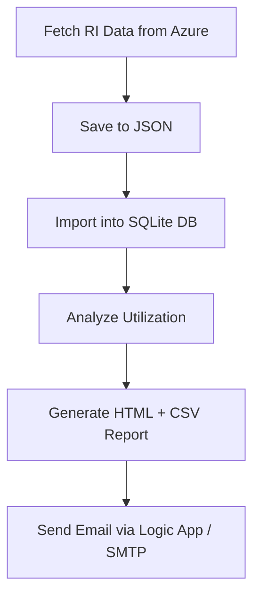

## 📊 Azure Reserved Instance (RI) Utilization Reporting System

This project automates the process of **retrieving**, **analyzing**, and **reporting** Azure Reserved Instance utilization data. It also sends daily email alerts with utilization summaries and warnings via **Azure Logic App** or **SMTP**.

------

### 🔁 Workflow Overview



------

### 📂 Folder Structure

```
CST8922-FinOps/
│
├── data/
│   ├── azure_ri_usage_summary_YYYY-MM-DD.json   # Raw usage snapshots
│   ├── ri_utilization_summary_YYYY-MM-DD.json   # Analysis output
│   └── ri_usage.db                              # SQLite DB for usage tracking
│
├── email_reports/
│   ├── user_at_email_com_YYYY-MM-DD.html        # Email HTML content
│   └── user_at_email_com_YYYY-MM-DD.csv         # CSV attachment
│
├── terraform/                                   # Infra as Code (optional)
│
├── query_azure_ri_data.py                       # Collect raw data from Azure
├── import_to_db.py                              # Import JSON into DB
├── analyze_ri_utilization.py                    # Perform analysis
├── send_html_reports.py                         # Email report generation and dispatch
├── email_utils.py                               # Email sending logic
├── .env                                         # Environment settings
└── requirements.txt
```

------

## 🧾 Step-by-Step Guide

------

### 1️⃣ Collect RI Usage from Azure

**Script**: `query_azure_ri_data.py`
 **Output**: JSON file named `azure_ri_usage_summary_YYYY-MM-DD.json`
 **Data structure example**:

```json
[
  {
    "subscription_id": "sub-001",
    "ri_id": "ri-eastus-001",
    "sku_name": "Standard_DS1_v2",
    "region": "eastus",
    "purchase_date": "2024-12-01",
    "term_months": 12,
    "utilization_percent": 22.3,
    "email_recipient": "cloudops@acme.com"
  }
]
```

⛔ *Note*: Due to student subscription limits, this can also be mocked manually.

------

### 2️⃣ Import JSON into Database

**Script**: `import_to_db.py --all`

- Loads all `azure_ri_usage_summary_*.json` files
- Avoids duplication (checks date+RI ID)
- Creates and writes into SQLite DB `data/ri_usage.db`

------

### 3️⃣ Analyze Utilization and Expiry Status

**Script**: `analyze_ri_utilization.py`
 **Modes**:

- `ANALYSIS_MODE=json` → Reads latest 7 JSON files
- `ANALYSIS_MODE=db` → Reads last 7 days from database

**Output file**: `ri_utilization_summary_YYYY-MM-DD.json`
 **Output format**:

```json
[
  {
    "subscription_id": "sub-001",
    "ri_id": "ri-eastus-001",
    "sku_name": "Standard_DS1_v2",
    "region": "eastus",
    "purchase_date": "2024-12-05",
    "term_months": 12,
    "utilization_percent": 22.3,
    "days_remaining": 185,
    "status": "underutilized",
    "expiry_status": "active",
    "underutilized_days": 7,
    "unused_days": 0,
    "missing_days": 0,
    "email_recipient": "yuntian.du93@gmail.com",
    "alert": "This RI has been underutilized for 7 consecutive days."
  }
]
```

### ⚠️ Field Descriptions

| Field                 | Description                                                  |
| --------------------- | ------------------------------------------------------------ |
| `subscription_id`     | Azure subscription ID                                        |
| `ri_id`               | Reserved Instance ID                                         |
| `sku_name`            | The SKU (instance type)                                      |
| `region`              | Azure region                                                 |
| `purchase_date`       | Date the RI was purchased                                    |
| `term_months`         | Term duration of the RI in months                            |
| `utilization_percent` | Latest usage percentage (over the analysis window)           |
| `days_remaining`      | Days until the RI expires                                    |
| `status`              | One of: `healthy`, `underutilized`, `unused`, `missing_data` |
| `expiry_status`       | One of: `active`, `expiring_soon`, `expired`                 |
| `underutilized_days`  | Number of consecutive days below the utilization threshold   |
| `unused_days`         | Number of consecutive days with 0 usage                      |
| `missing_days`        | Number of days with missing data                             |
| `email_recipient`     | Recipient to whom the report is sent                         |
| `alert`               | Warning message generated based on usage trends              |

------

### 4️⃣ Send Emails with HTML + CSV Reports

**Script**: `send_html_reports.py`

- Groups reports by `email_recipient`
- Generates HTML report and CSV attachment
- Sends via:
  - SMTP if `EMAIL_METHOD=smtp`
  - Logic App if `EMAIL_METHOD=logicapp`

📧 **Email content**:

- Summary table with **color-coded rows**
- Alert messages like:
  - ❗ `ri-eastus-002 is unused for 3 days`
  - ⚠️ `ri-eastus-004 is underutilized for 5 days`

------

## 🛠️ .env Configuration

```
# Email Settings
EMAIL_METHOD=logicapp               # logicapp or smtp
SMTP_HOST=smtp.example.com
SMTP_PORT=587
SMTP_USER=your_username
SMTP_PASS=your_password
LOGICAPP_ENDPOINT=https://prod-00...

# Thresholds
MIN_UTILIZATION_THRESHOLD=60
EXPIRY_WARNING_DAYS=30
ANALYSIS_WINDOW_DAYS=7
ALARM_DAY_THRESHOLD=3

# Default values
DEFAULT_REGION=eastus
DEFAULT_SKU=Standard_DS1_v2
```

------

## 🧪 Quick Start Commands

```bash
# Create virtualenv
python3 -m venv .venv
.venv\Scripts\activate

# Install packages
pip install -r requirements.txt

# Simulate pipeline
python3 import_to_db.py --all
python3 analyze_ri_utilization.py
python3 send_html_reports.py
```

------

# Start Via Shell script Or Python main.py

## ✅ run_pipeline.sh


### ✅ Python main.py Usage

```
bashCopyEdit# Run the full pipeline
python main.py --mode all

# Only import JSON files to DB
python main.py --mode import

# Only analyze utilization
python main.py --mode analyze

# Only send emails (after analysis JSON is ready)
python main.py --mode send
```


## 🧩 Notes

- Compatible with both **real Azure API data** and **mocked JSON files**
- Easily expandable for cost tracking, chart generation, etc.
- Supports per-recipient email customization